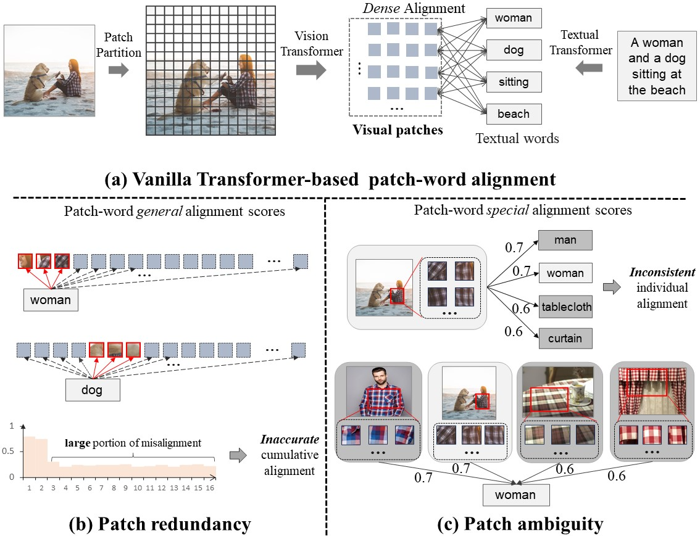
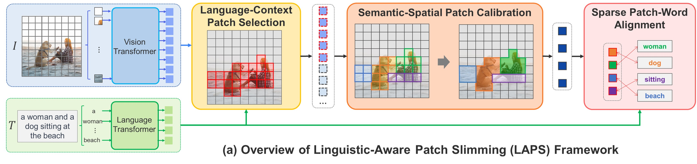

# Linguistic-Aware Patch Slimming Framework for Fine-grained Cross-Modal Alignment

The official codes for our paper "[Linguistic-Aware Patch Slimming Framework for Fine-grained Cross-Modal Alignment](https://openaccess.thecvf.com/content/CVPR2024/html/Fu_Linguistic-Aware_Patch_Slimming_Framework_for_Fine-grained_Cross-Modal_Alignment_CVPR_2024_paper.html)", which is accepted by the  IEEE/CVF Conference on Computer Vision and Pattern Recognition (**CVPR**), 2024.
We referred to the implementations of [VSE++](https://github.com/fartashf/vsepp), [SCAN](https://github.com/kuanghuei/SCAN), [GPO](https://github.com/woodfrog/vse_infty), and [HREM](https://github.com/CrossmodalGroup/HREM) to build up the repository. 


## Introduction
Cross-modal alignment aims to build a bridge connecting vision and language. 
It is an important multi-modal task that efficiently learns the semantic similarities between images and texts.
Traditional fine-grained alignment methods heavily rely on pre-trained object detectors to extract region features for subsequent region-word alignment, thereby incurring substantial computational costs for region detection and error propagation issues for two-stage training.

<div align=center>

</div>

In this paper, we focus on the mainstream vision transformer, incorporating patch features for patch-word alignment, while addressing the resultant issue of visual patch redundancy and patch ambiguity for semantic alignment.
We propose a novel Linguistic-Aware Patch Slimming (LAPS) framework for fine-grained alignment, 
which explicitly identifies redundant visual patches with language supervision and rectifies their semantic and spatial information to facilitate more effective and consistent patch-word alignment.
Extensive experiments on various evaluation benchmarks and model backbones show LAPS outperforms the state-of-the-art fine-grained alignment methods.

<div align=center>

</div>


## Preparation

### Environments
We recommended the following dependencies:
- python >= 3.8
- torch >= 1.12.0
- torchvision >= 0.13.0
- transformers >=4.32.0
- opencv-python
- tensorboard


### Datasets

We have prepared the caption files for two datasets in  `data/` folder, hence you just need to download the images of the datasets. 
The Flickr30K (f30k) images can be downloaded in [flickr30k-images](https://www.kaggle.com/datasets/hsankesara/flickr-image-dataset). The MSCOCO (coco) images can be downloaded in [train2014](http://images.cocodataset.org/zips/train2014.zip), and [val2014](http://images.cocodataset.org/zips/val2014.zip).
We hope that the final data are organized as follows:


```
data
├── coco  # coco captions
│   ├── train_ids.txt
│   ├── train_caps.txt
│   ├── testall_ids.txt
│   ├── testall_caps.txt
│   └── id_mapping.json
│
├── f30k  # f30k captions
│   ├── train_ids.txt
│   ├── train_caps.txt
│   ├── test_ids.txt
│   ├── test_caps.txt
│   └── id_mapping.json
│
├── flickr30k-images # f30k images
│
├── coco-images # coco images
│   ├── train2014
│   └── val2014
```


### Model Weights

Our framework needs to get the pre-trained weights for [BERT-base](https://huggingface.co/bert-base-uncased), [ViT-base](https://huggingface.co/google/vit-base-patch16-224-in21k), and [Swin-base](https://huggingface.co/microsoft/swin-base-patch4-window7-224) models. 
You also can choose the weights downloaded by [transformers](https://github.com/huggingface/transformers) automatically (the weights will be downloaded at  `~/.cache`).


## Training
First, we set up the **arguments**, detailed information about the arguments is shown in ```arguments.py```.

- `--dataset`: the chosen datasets, e.g., `f30k` and `coco`.
- `--data_path`: the root path of datasets, e.g., `data/`.
- `--multi_gpu`: whether to use the multiple GPUs (DDP) to train the models.
- `--gpu-id`, the chosen GPU number, e.g., 0-7.
- `--logger_name`, the path of logger files, e.g., `runs/f30k_test` or `runs/coco_test`


Then, we run the ```train.py``` for model training. 
The models need about 20,000 GPU-Memory (one 3090 GPU) when batch size = 64 and about 40,000 GPU-Memory (one A40 GPU) when batch size = 108.
You need to modify the batch size according to the hardware conditions, and we also support the **multiple GPUs** training. 
Besides, considering the GPU-memory limitation, we don't integrate the Gumbel-softmax sampling for the patch selection in the repository. 
The performances are not affected much but GPU-memory is reduced a lot (see more details in the paper).

### Shared-backbone fair comparison

To support controlled comparisons under the same raw-image pipeline and ViT/Swin + BERT backbone, we provide shared-backbone presets through `--model_variant`.

- `vsepp_shared`: global image pooling + global text pooling.
- `scan_shared`: SCAN-style cross-attention over the same image patches and BERT tokens.
- `sgr_shared`: SGR-style similarity reasoning over shared ViT/Swin patches and BERT tokens.
- `chan_shared`: CHAN-style hard patch-word assignment with mean pooling.
- `basealign`: patch-word max-mean matching without sparse token selection or aggregation.
- `sparse`: `basealign` + sparse token selection.
- `laps`: the default full model with sparse token selection, token aggregation, and ratio regularization.

The preset automatically sets `--alignment_mode` and `--sim_head`. By default, training now uses `dev` for validation and `test` / `testall` for final reporting. You can still override `--use_sparse`, `--use_aggr`, `--use_ratio_loss`, `--sim_head`, `--val_split`, or `--test_split` manually if needed.

Example on ViT + Flickr30K:

```bash
python train.py --dataset f30k --gpu-id 0 --logger_name runs/f30k_vsepp_shared --batch_size 64 --vit_type vit --embed_size 512 --model_variant vsepp_shared
python train.py --dataset f30k --gpu-id 0 --logger_name runs/f30k_scan_shared --batch_size 64 --vit_type vit --embed_size 512 --model_variant scan_shared
python train.py --dataset f30k --gpu-id 0 --logger_name runs/f30k_sgr_shared --batch_size 64 --vit_type vit --embed_size 512 --model_variant sgr_shared
python train.py --dataset f30k --gpu-id 0 --logger_name runs/f30k_chan_shared --batch_size 64 --vit_type vit --embed_size 512 --model_variant chan_shared
python train.py --dataset f30k --gpu-id 0 --logger_name runs/f30k_basealign --batch_size 64 --vit_type vit --embed_size 512 --model_variant basealign
python train.py --dataset f30k --gpu-id 0 --logger_name runs/f30k_sparse --batch_size 64 --vit_type vit --embed_size 512 --model_variant sparse --sparse_ratio 0.5
python train.py --dataset f30k --gpu-id 0 --logger_name runs/f30k_laps --batch_size 64 --vit_type vit --embed_size 512 --model_variant laps --sparse_ratio 0.5 --aggr_ratio 0.4
```

For PBS clusters, we also provide:

- `pbs/train_f30k_shared_backbone.pbs`: one shared job template.
- `pbs/submit_f30k_shared_backbone_chain.sh`: submit the five Flickr30K fair-comparison runs sequentially.

```bash
cd ./DSA5204-Group-Project

# safer default for unknown GPU memory
BATCH_SIZE=32 NUM_EPOCHS=30 ./pbs/submit_f30k_shared_backbone_chain.sh

# if your GPU has enough memory, this is closer to the paper setup
BATCH_SIZE=64 NUM_EPOCHS=30 ./pbs/submit_f30k_shared_backbone_chain.sh
```

## single GPU

### vit + f30k 
python train.py --dataset f30k --gpu-id 0 --logger_name runs/f30k_vit --batch_size 64 --vit_type vit --embed_size 512 --sparse_ratio 0.5 --aggr_ratio 0.4

### swin + f30k
python train.py --dataset f30k --gpu-id 0 --logger_name runs/f30k_swin --batch_size 64 --vit_type swin  --embed_size 512 --sparse_ratio 0.8 --aggr_ratio 0.6

### vit + coco 
python train.py --dataset coco --gpu-id 0 --logger_name runs/coco_vit --batch_size 64 --vit_type vit --embed_size 512 --sparse_ratio 0.5 --aggr_ratio 0.4

### swin + coco
python train.py --dataset coco --gpu-id 0 --logger_name runs/coco_swin --batch_size 64 --vit_type swin  --embed_size 512 --sparse_ratio 0.8 --aggr_ratio 0.6


## multiple GPUs

### vit + f30k
CUDA_VISIBLE_DEVICES=0,1 python -m torch.distributed.run --nproc_per_node=2 train.py --dataset f30k --multi_gpu 1 --logger_name runs/f30k_vit --batch_size 64 --vit_type vit --embed_size 512 --sparse_ratio 0.5 --aggr_ratio 0.4

### swin + f30k
CUDA_VISIBLE_DEVICES=0,1 python -m torch.distributed.run --nproc_per_node=2 train.py --dataset f30k --multi_gpu 1 --logger_name runs/f30k_swin --batch_size 64 --vit_type swin --embed_size 1024 --sparse_ratio 0.8 --aggr_ratio 0.6


### vit + coco
CUDA_VISIBLE_DEVICES=0,1,2,3 python -m torch.distributed.run --nproc_per_node=4 train.py --dataset coco --multi_gpu 1 --logger_name runs/coco_vit --batch_size 64 --vit_type vit --embed_size 512 --sparse_ratio 0.5 --aggr_ratio 0.4

### swin + coco
CUDA_VISIBLE_DEVICES=0,1,2 python -m torch.distributed.run --nproc_per_node=3 train.py --dataset coco --multi_gpu 1 --logger_name runs/coco_swin --batch_size 72 --vit_type swin --embed_size 512 --sparse_ratio 0.8 --aggr_ratio 0.6
CUDA_VISIBLE_DEVICES=0,1,2,3 python -m torch.distributed.run --nproc_per_node=4 train.py --dataset coco --multi_gpu 1 --logger_name runs/coco_swin --batch_size 64 --vit_type swin --embed_size 512 --sparse_ratio 0.8 --aggr_ratio 0.6
```

## Detector Features and Table 3 Utilities

The repository also includes PBS utilities for the detector-based baselines and the CLIP-based zero-shot grounding evaluation.

### Download pre-computed Faster R-CNN features

```bash
qsub ./pbs/download_scan_features_cpu.pbs
```

This script downloads the SCAN-style precomputed region features used by methods such as HREM, TGDT, and detector-based CHAN.

### Prepare TGDT Flickr30K inputs

TGDT expects TERAN-style Flickr30K inputs with per-image `.npz` bottom-up features and a `dataset_flickr30k.json` annotation file. The helper below converts the downloaded SCAN-style arrays into that layout.

```bash
qsub ./pbs/prepare_tgdt_f30k_cpu.pbs
qsub -W depend=afterok:<prep_jobid> ./pbs/train_f30k_tgdt_precomp.pbs
```

### Download Table 3 grounding data

```bash
qsub ./pbs/download_grounding_data_cpu.pbs
```

This script downloads COCO `train2014` together with the `RefCOCO`, `RefCOCO+`, and `RefCOCOg` annotations required for the zero-shot grounding evaluation.

### Train CLIP-based retrieval models for Table 3

The Table 3 experiments use CLIP ViT-B/16 backbones trained on Flickr30K. The PBS template below reuses `train.py` with CLIP image and text encoders.

```bash
qsub -q batch_gpu -v MODEL_VARIANT=vsepp_shared ./pbs/train_f30k_clip_table3.pbs
qsub -q batch_gpu -v MODEL_VARIANT=scan_shared ./pbs/train_f30k_clip_table3.pbs
qsub -q batch_gpu -v MODEL_VARIANT=sgr_shared ./pbs/train_f30k_clip_table3.pbs
qsub -q batch_gpu -v MODEL_VARIANT=laps ./pbs/train_f30k_clip_table3.pbs
```

### Evaluate zero-shot grounding for Table 3

The grounding evaluator supports both vanilla CLIP and trained retrieval checkpoints.

```bash
# vanilla CLIP row
qsub -q gpu -v MODEL_TYPE=vanilla_clip ./pbs/eval_table3_grounding.pbs

# trained rows
qsub -q gpu -v MODEL_TYPE=checkpoint,MODEL_VARIANT=vsepp_shared ./pbs/eval_table3_grounding.pbs
qsub -q gpu -v MODEL_TYPE=checkpoint,MODEL_VARIANT=scan_shared ./pbs/eval_table3_grounding.pbs
qsub -q gpu -v MODEL_TYPE=checkpoint,MODEL_VARIANT=sgr_shared ./pbs/eval_table3_grounding.pbs
qsub -q gpu -v MODEL_TYPE=checkpoint,MODEL_VARIANT=laps ./pbs/eval_table3_grounding.pbs
```

For convenience, the helper script below can submit the full training or evaluation batch:

```bash
./pbs/submit_table3_jobs.sh train_all
./pbs/submit_table3_jobs.sh eval_all
```

## Additional Lightweight Retrieval Datasets

The repository now supports two lightweight extension datasets:

- `iapr_tc12`
- `rsicd`

The runtime expects the same normalized caption format used by `f30k` and `coco`:

```text
data/<dataset>/
├── train_ids.txt
├── train_caps.txt
├── train_capimgids.txt
├── dev_ids.txt
├── dev_caps.txt
├── dev_capimgids.txt
├── test_ids.txt
├── test_caps.txt
├── test_capimgids.txt
└── id_mapping.json
```

Two preparation scripts convert common raw releases into this format.

### Prepare IAPR TC-12

To download the raw archive first:

```bash
qsub ./pbs/download_iapr_tc12_cpu.pbs
```

```bash
qsub ./pbs/prepare_iapr_tc12_cpu.pbs
```

Useful overrides:

```bash
qsub -v RAW_ROOT=/scratch/e1553870/datasets/iapr_tc12_raw,IMAGE_ROOT=/scratch/e1553870/datasets/iapr_tc12/images,ANNOTATION_FILE=/scratch/e1553870/datasets/iapr_tc12_raw/annotations.tsv ./pbs/prepare_iapr_tc12_cpu.pbs
```

### Prepare RSICD

```bash
qsub ./pbs/prepare_rsicd_cpu.pbs
```

Useful overrides:

```bash
qsub -v ANNOTATION_JSON=/scratch/e1553870/datasets/rsicd_raw/dataset_rsicd.json,IMAGE_ROOT=/scratch/e1553870/datasets/rsicd/images ./pbs/prepare_rsicd_cpu.pbs
```

### Train on IAPR TC-12 or RSICD

Use the shared-backbone PBS template below for both datasets.

```bash
qsub -v DATASET=iapr_tc12,MODEL_VARIANT=laps,VIT_TYPE=vit ./pbs/train_extra_dataset_shared_backbone.pbs
qsub -v DATASET=rsicd,MODEL_VARIANT=laps,VIT_TYPE=vit ./pbs/train_extra_dataset_shared_backbone.pbs
```

The same template also supports `vsepp_shared`, `scan_shared`, `sgr_shared`, and `chan_shared`, and can be switched to Swin with `VIT_TYPE=swin`.

### Evaluate on IAPR TC-12 or RSICD

```bash
qsub -v DATASET=iapr_tc12,MODEL_VARIANT=laps,VIT_TYPE=vit ./pbs/eval_extra_dataset_shared_backbone.pbs
qsub -v DATASET=rsicd,MODEL_VARIANT=laps,VIT_TYPE=vit ./pbs/eval_extra_dataset_shared_backbone.pbs
```

For convenience, the helper below submits the full five-row shared-backbone table for either dataset:

```bash
./pbs/submit_iapr_tc12_chain.sh
./pbs/submit_extra_dataset_jobs.sh train_all iapr_tc12
./pbs/submit_extra_dataset_jobs.sh eval_all iapr_tc12
./pbs/submit_extra_dataset_jobs.sh train_all rsicd
./pbs/submit_extra_dataset_jobs.sh eval_all rsicd
```

## Evaluation
Run ```eval.py``` to evaluate the trained models on f30k or coco datasets, and you need to specify the model paths.

```
python eval.py --dataset f30k --data_path data/ --gpu-id 0
python eval.py --dataset coco --data_path data/ --gpu-id 1
```


## Performances
The following tables show the reproducing results of cross-modal retrieval on **MSCOCO** and **Flickr30K** datasets. 
We provide the training logs, checkpoints, performances, and hyper-parameters.

|Datasets| Visual encoders |I2T R@1|I2T R@5|T2I R@1|T2I R@5|Model checkpoint|
|:---:|:---:|:---:|:---:|:---:|:---:|:---:|
|Flickr30K |ViT | 75.8 | 93.8 | 62.5  |87.5 |[Link](https://drive.google.com/drive/folders/1m3Y9TMkas2efSbeDV_ESci6uwMGd3MUY?usp=sharing)|
|Flickr30K |Swin | 84.5 | 97.7 | 72.3 | 92.7 |[Link](https://drive.google.com/drive/folders/1jd4i2sGEtbYjkNwjas51NTHmiOmq7Zaz?usp=sharing)|
|MSCOCO-1K |ViT | 78.6 | 96.0 | 65.5 | 91.4 |[Link](https://drive.google.com/drive/folders/1C0XZ7FAoq47huy6gItcIV4XqudRVfe3n?usp=sharing)|
|MSCOCO-1K |Swin | 83.9 | 97.9 | 51.2 | 79.3 |[Link](https://drive.google.com/drive/folders/1JvSVOjIQhofGveR2m8xPGiwhuFutyi15?usp=sharing)|
|MSCOCO-5K |ViT | 56.1 | 83.9 | 71.9 | 93.7 |[Link](https://drive.google.com/drive/folders/1C0XZ7FAoq47huy6gItcIV4XqudRVfe3n?usp=sharing)|
|MSCOCO-5K |Swin | 65.1 | 90.2 | 51.2 | 79.3 |[Link](https://drive.google.com/drive/folders/1JvSVOjIQhofGveR2m8xPGiwhuFutyi15?usp=sharing)|


## Reference

```
@inproceedings{fu2024linguistic,
  title={Linguistic-aware patch slimming framework for fine-grained cross-modal alignment},
  author={Fu, Zheren and Zhang, Lei and Xia, Hou and Mao, Zhendong},
  booktitle={Proceedings of the IEEE/CVF Conference on Computer Vision and Pattern Recognition},
  pages={26307--26316},
  year={2024}
}
```
